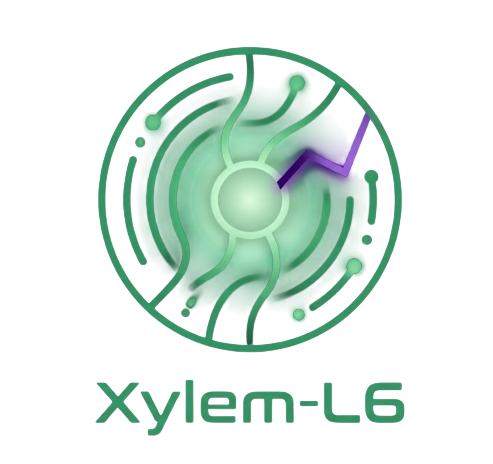
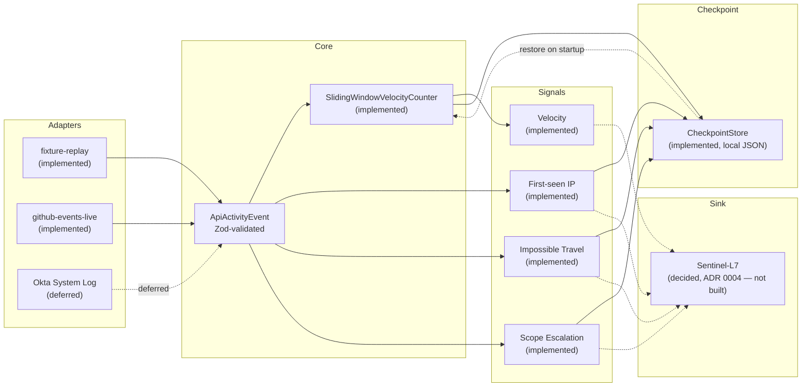

<p align="center">
  
</p>

**Xylem-L6** is a standalone TypeScript stream processor that ingests SaaS API activity — GitHub's public Events API live, and hand-authored Okta-shaped fixture data for on-demand windowing conditions — and computes stateful security signals over them — request velocity, failed-auth bursts, first-seen IP/device/user-agent, impossible travel, and scope escalation. It exists to close a gap in the wider Rhizome Risk suite: nothing else in the suite ([EventHorizon](https://github.com/obrienma/EventHorizon), [Sentinel-L7](https://github.com/obrienma/sentinel-l7), [Synapse-L4](https://github.com/obrienma/synapse-l4)) holds state across events, computes over a sliding time window, handles out-of-order arrival, or applies in-process backpressure. See [ADR 0001](docs/adr/0001-ingestion-target-stream-processor.md) for the full rationale.

> [!NOTE]
> **Status: Phase 4 decided.** All four trackers — Phase 1's sliding-window velocity counter and Phase 2's first-seen IP tracker, impossible travel detector, and scope escalation tracker — checkpoint their combined state to a local JSON file after every event and restore it on startup (Phase 3). [ADR 0004](docs/adr/0004-sentinel-l7-sink-decision.md) fixes Xylem-L6's Phase 4 sink as **Sentinel-L7** — a decision, not an integration. [ADR 0005](docs/adr/0005-fusion-function-max-of-signals.md) fixes the fusion function (max-of-signals) that will turn the four discrete signals into Sentinel-L7's expected single score — also a decision, not yet implemented. [ADR 0006](docs/adr/0006-tenant-label-on-api-activity-event.md) adds an optional `tenant` field to `ApiActivityEvent`, prompted by a customer-attribution gap in Ledger-L5's billing contract — implemented, including a `fixture-replay` scenario demonstrating (not fixing) the single-tenant tracker-keying limitation. A policy-corpus ADR (Sentinel-L7 side) is still required before any wiring happens.

---

## 📋 Contents

- [📋 Contents](#-contents)
- [🧰 Stack](#-stack)
- [🚀 Running the Project](#-running-the-project)
- [🏗️ Architecture](#️-architecture)
  - [🔀 Pipeline Diagram](#-pipeline-diagram)
  - [🗂️ Provider Adapters](#️-provider-adapters)
- [📚 Docs](#-docs)
- [🗺️ Roadmap](#️-roadmap)
  - [📋 Planned Phases](#-planned-phases)
  - [🔭 Deliberately Deferred](#-deliberately-deferred)


## 🧰 Stack

**⚡ Core**

- **TypeScript + Zod:** Canonical `ApiActivityEvent` contract and provider-adapter inputs validated at runtime with Zod — chosen deliberately for interview relevance (upcoming backend TypeScript interview) and to close the suite's only backend-TS streaming gap. See [ADR 0001](docs/adr/0001-ingestion-target-stream-processor.md).
- **Two provider adapters behind one shared interface (`ActivityAdapter`), implemented:** `fixture-replay` (hand-authored sample schedule with a baseline, a burst, a gap, a late/out-of-order event, and — per [ADR 0006](docs/adr/0006-tenant-label-on-api-activity-event.md) — a second synthetic tenant interleaved via a colliding actor id — controllable per-event delay and jitter) and `github-events-live` (GitHub's public Events API, polled against a real account, deduped by event id). Okta's System Log API is a deferred third candidate.
- **In-memory sliding-window velocity counter (`src/core/window.ts`):** event-time-driven, not wall-clock-driven — a per-actor watermark governs retention so a late-arriving event doesn't lose data recorded after it. Retains `2 × windowMs` of history to correctly answer a late event's own trailing window; an event later than one full `windowMs` behind the watermark falls outside that bound and may be undercounted (a known, documented Phase 1 limitation — a real "allowed lateness" config is Phase 2+).
- **Three Phase 2 running-state signals** — a different shape of state than Phase 1's window: no eviction, just a per-actor seen-set or single last-known point.
  - **First-seen IP tracker (`src/core/firstSeen.ts`):** per-actor `Set` of source IPs seen so far; flags an event from an IP not previously seen for that actor, including (by design) the actor's very first observed IP.
  - **Impossible travel detector (`src/core/impossibleTravel.ts`):** per-actor last-known `(lat, lon, timestamp)`; flags a new geo-tagged event if the implied speed from the previous point exceeds a configurable plausible-travel threshold (haversine great-circle distance ÷ time delta).
  - **Scope escalation tracker (`src/core/scopeEscalation.ts`):** per-actor `Set` of scopes ever exercised; flags a scope appearing for the first time — but only once the actor already has a baseline, so the very first event establishes scopes rather than "escalating" into them.
- **Checkpointing (`src/core/checkpoint.ts`, Phase 3):** each of the four trackers above exposes `getState()`/`loadState()`, exporting its internal `Map`/`Set` state as plain JSON-serializable data. `CheckpointStore` bundles all four into one versioned JSON file (`.xylem-checkpoint.json`, gitignored — local disk only, not the Phase 4+ GCP Firestore target), saved via a single `checkpoint.save()` call site after every event and restored on startup if present. Checkpointing every event, rather than on an interval, keeps the store always current with no debouncing/dirty-flag logic — the right tradeoff at this project's demo-scale throughput.

**🧪 Testing & Dev**

- **Vitest:** Test runner — `tests/` mirrors `src/`, colocated by module. 40 tests covering the schema, the velocity counter (including the late/out-of-order case), the three Phase 2 signal trackers, the Phase 3 checkpoint store, state round-trips for all four trackers, both adapters (GitHub calls mocked via an injectable `fetchImpl`, never a real network call), and a domain-isolation arch test (`tests/arch.test.ts`).
- **tsx:** Runs TypeScript directly in dev without a separate build step.

**☁️ Deployment (planned, Phase 4+)**

- **GCP Pub/Sub** as the ingestion transport, replacing adapter-level polling.
- **GCP Firestore** as the checkpoint store's eventual backing store, replacing the local JSON file Phase 3 uses — enables restart survival across ephemeral GKE pods, not just a single machine's disk.
- **GKE**, in the same shared-cluster namespace pattern already used by EventHorizon and Rhizome Lens.
- Deployment target is GCP, not Railway — see [ADR 0003](docs/adr/0003-gcp-deployment-target.md) for the full reasoning, including the credits-vs-Always-Free distinction.


## 🚀 Running the Project

### ✅ Prerequisites

- **Node.js 24+** with npm
- A **GitHub personal access token** (no special scope needed) — only required for the `github-events-live` adapter; `fixture-replay` needs nothing.

### ⚡ Quick Start

```bash
# 1. Install dependencies
npm install

# 2. Type-check
npx tsc --noEmit

# 3. Run the test suite
npm test

# 4. Run the demo against fixture-replay (default, no credentials needed)
npm run dev

# 5. Or run it against real live GitHub activity
XYLEM_ADAPTER=github-events-live GITHUB_USERNAME=<you> GITHUB_TOKEN=<token> npm run dev
```

`npm run dev` prints one line per event: timestamp, actor, action, and the current sliding-window velocity for that actor, flagging `[VELOCITY BREACH]` at 3+ events in the window, `[FIRST-SEEN IP ...]` on a new source IP for that actor, `[IMPOSSIBLE TRAVEL ...km/h]` on a geo-implausible jump, and `[SCOPE ESCALATION ...]` on a new scope after a baseline is established. State checkpoints to `.xylem-checkpoint.json` after every event (override the path with `XYLEM_CHECKPOINT_FILE`) and is restored on the next run — printing `(resumed from checkpoint)` on startup when it finds one. Delete that file to start fresh. Still no external sink — this is a demo, not a running service.


## 🏗️ Architecture

### 🔀 Pipeline Diagram



No sink was assumed at Phase 1–3 — the pipeline ended at signal computation until the Phase 4 decision was made. [ADR 0002](docs/adr/0002-sentinel-l7-integration-direction.md) recorded a forward-looking direction toward Sentinel-L7 without committing to it; [ADR 0004](docs/adr/0004-sentinel-l7-sink-decision.md) converts that direction into the committed Phase 4 sink. The pipeline diagram's Sink node reflects the decision, not a built integration — no wiring exists yet.

### 🗂️ Provider Adapters

| Adapter | Source | Purpose |
| :--- | :--- | :--- |
| `fixture-replay` | Static/hand-authored sample events | The only adapter that can reliably force specific windowing conditions on demand — a late/out-of-order event, a burst, a gap — that a live source can't be made to produce on request. |
| `github-events-live` | GitHub public Events API (`GET /users/{username}/events`) | Genuine live traffic from a real account. Narrower in shape than a true audit log — public activity only, no auth/session-level events — so impossible-travel and failed-auth-burst signals aren't demonstrable against it. |
| Okta System Log API | _Deferred_ | The one candidate provider whose schema is genuinely audit-log-shaped (auth/session events); would close the live-adapter gap `github-events-live` leaves for impossible-travel and failed-auth-burst signals. |


## 📚 Docs

| File | Contents | Last updated |
| --- | --- | --- |
| [README.md](README.md) | Project overview | 2026-07-13 |
| [ADR 0001](docs/adr/0001-ingestion-target-stream-processor.md) | Ingestion target (SaaS API activity) and standalone stream-processor architecture | 2026-07-13 |
| [ADR 0002](docs/adr/0002-sentinel-l7-integration-direction.md) | Sentinel-L7 integration direction — forward-looking, not committed | 2026-07-13 |
| [ADR 0003](docs/adr/0003-gcp-deployment-target.md) | GCP as deployment target (Pub/Sub, Firestore, GKE) | 2026-07-13 |
| [ADR 0004](docs/adr/0004-sentinel-l7-sink-decision.md) | Phase 4 sink decision — Sentinel-L7, committed direction, no integration built | 2026-07-14 |
| [ADR 0005](docs/adr/0005-fusion-function-max-of-signals.md) | Fusion function — max-of-signals, chosen over weighted-sum for lack of signal-history/label data; not yet implemented | 2026-07-14 |
| [ADR 0006](docs/adr/0006-tenant-label-on-api-activity-event.md) | Optional `tenant` field on `ApiActivityEvent`, prompted by Ledger-L5's customer-attribution gap; implemented, incl. a fixture scenario demonstrating the single-tenant tracker-keying limitation | 2026-07-16 |
| [journal/](docs/journal/) | Engineering journal — one entry per phase, paired with Anki probes in [probes/](docs/probes/) | 2026-07-16 |


## 🗺️ Roadmap

### 📋 Planned Phases

Per [ADR 0001](docs/adr/0001-ingestion-target-stream-processor.md), each phase is independently demoable:

* [x] **Phase 1** — canonical `ApiActivityEvent` Zod schema, both adapters (`fixture-replay` and `github-events-live`) behind a shared interface, in-memory sliding-window velocity counter. No persistence, no external hookup.
* [x] **Phase 2** — stateful signals that need running state rather than a window-only counter: first-seen IP tracker, impossible travel detector, scope escalation tracker (see [ADR 0001 addendum](docs/adr/0001-ingestion-target-stream-processor.md#addendum-2026-07-13-post-phase-1) for why scope escalation is in scope). First-seen tracking is IP-only for now — device/user-agent isn't in the `ApiActivityEvent` schema and no adapter currently supplies it.
* [x] **Phase 3** — checkpointing, so a process restart doesn't silently drop in-flight window/state. Each tracker exports/imports its state via `getState()`/`loadState()`; `CheckpointStore` persists all four to a single local JSON file after every event and restores it on startup.
* [x] **Phase 4** — sink decision, made deliberately by ADR when reached (not assumed in advance): [ADR 0004](docs/adr/0004-sentinel-l7-sink-decision.md) fixes the sink as Sentinel-L7, and [ADR 0005](docs/adr/0005-fusion-function-max-of-signals.md) fixes the fusion function as max-of-signals. Decisions only — no integration code; a policy-corpus ADR (Sentinel-L7 side) is still required before wiring.
* [x] **Phase 4 addendum** — [ADR 0006](docs/adr/0006-tenant-label-on-api-activity-event.md) adds an optional `tenant` field to `ApiActivityEvent`, closing a customer-attribution gap surfaced by Ledger-L5's billing contract. Implemented: schema field, plus a `fixture-replay` scenario (`evt-11`..`evt-13`) interleaving a second synthetic tenant (`globex`) with a colliding actor id, demonstrating — not fixing — the single-tenant tracker-keying limitation (a real velocity breach produced by combining two tenants' events under one actor id). Tracker keying stays `actor.id`-only; composite-keying is deferred until a second real tenant exists.

### 🔭 Deliberately Deferred

* **Okta System Log adapter** — the genuinely audit-log-shaped provider (auth/session events); would unlock live impossible-travel and failed-auth-burst signal demos. Not started.
* **First-seen device/user-agent tracking** — `FirstSeenIpTracker` (Phase 2) covers source IP only; device/UA would need a new `ApiActivityEvent` field neither adapter currently populates, so it wasn't added speculatively.
* **Failed-auth-burst signal** — named in ADR 0001's full signal set but not scoped into Phase 2 by the ADR's build order or its addendum; would need auth-event data neither adapter reliably carries today (see the `github-events-live` row above).
* **Sentinel-L7 scored-output integration** — the sink is decided ([ADR 0004](docs/adr/0004-sentinel-l7-sink-decision.md)) and the fusion function is decided ([ADR 0005](docs/adr/0005-fusion-function-max-of-signals.md), max-of-signals), but neither is implemented, and a SaaS-domain policy corpus on Sentinel-L7's side still needs its own follow-up ADR. See [ADR 0002](docs/adr/0002-sentinel-l7-integration-direction.md) for the original direction.
* **GCP deployment (Pub/Sub, Firestore, GKE)** — architecturally decided ([ADR 0003](docs/adr/0003-gcp-deployment-target.md)) but not built; Phase 3's local-JSON checkpoint store is the placeholder Firestore will eventually replace.
* **Composite tracker keying (`tenant:actor.id`)** — deliberately not done. [ADR 0006](docs/adr/0006-tenant-label-on-api-activity-event.md) added the `tenant` field and a fixture scenario that demonstrates the resulting false-positive risk (two tenants sharing an actor id), but the trackers themselves stay `actor.id`-only until a second real tenant enters the system — composite-keying now would be speculative complexity against a hypothetical, not a real, collision.
