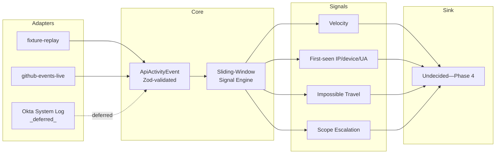

# Xylem-L6

**Xylem-L6** is a standalone TypeScript stream processor that ingests SaaS API activity logs (GitHub, Okta, Auth0, Slack-style audit formats) and computes stateful security signals over them — request velocity, failed-auth bursts, first-seen IP/device/user-agent, impossible travel, and scope escalation. It exists to close a gap in the wider Rhizome Risk suite: nothing else in the suite ([EventHorizon](https://github.com/obrienma/EventHorizon), [Sentinel-L7](https://github.com/obrienma/sentinel-l7), [Synapse-L4](https://github.com/obrienma/synapse-l4)) holds state across events, computes over a sliding time window, handles out-of-order arrival, or applies in-process backpressure. See [ADR 0001](docs/adr/0001-ingestion-target-stream-processor.md) for the full rationale.

> [!NOTE]
> **Status: scaffolding only.** The project skeleton (TypeScript + Zod + Vitest, canonical `ApiActivityEvent` schema, adapter interface, adapter stubs) is in place and runnable, but Phase 1 itself — real adapter implementations and the sliding-window velocity counter — has not been built yet. Both adapters currently throw `not implemented`.

---

## 📋 Contents

- [📋 Contents](#-contents)
- [🧰 Stack](#-stack-planned)
- [🚀 Running the Project](#-running-the-project)
- [🏗️ Architecture](#️-architecture)
  - [🔀 Pipeline Diagram](#-pipeline-diagram)
  - [🗂️ Provider Adapters](#️-provider-adapters)
- [📚 Docs](#-docs)
- [🗺️ Roadmap](#️-roadmap)
  - [📋 Planned Phases](#-planned-phases)
  - [🔭 Deliberately Deferred](#-deliberately-deferred)


## 🧰 Stack (planned)

**⚡ Core**

- **TypeScript + Zod:** Canonical `ApiActivityEvent` contract and provider-adapter inputs validated at runtime with Zod — chosen deliberately for interview relevance (upcoming backend TypeScript interview) and to close the suite's only backend-TS streaming gap. See [ADR 0001](docs/adr/0001-ingestion-target-stream-processor.md).
- **Two provider adapters behind one shared interface, from Phase 1:** `fixture-replay` (static/hand-authored sample events with controllable timing/jitter, for forcing specific windowing edge cases on demand) and `github-events-live` (GitHub's public Events API, polled against a real account). Okta's System Log API is a deferred third candidate.

**🧪 Testing & Dev**

- **Vitest:** Test runner — `tests/` mirrors `src/`, colocated by module. `tests/core/types.test.ts` is a smoke test validating the `ApiActivityEvent` Zod schema.
- **tsx:** Runs TypeScript directly in dev without a separate build step.

**☁️ Deployment (planned, Phase 4+)**

- **GCP Pub/Sub** as the ingestion transport, replacing adapter-level polling.
- **GCP Firestore** for checkpoint state (window recovery across restarts).
- **GKE**, in the same shared-cluster namespace pattern already used by EventHorizon and Rhizome Lens.
- Deployment target is GCP, not Railway — see [ADR 0003](docs/adr/0003-gcp-deployment-target.md) for the full reasoning, including the credits-vs-Always-Free distinction.


## 🚀 Running the Project

### ✅ Prerequisites

- **Node.js 24+** with npm

### ⚡ Quick Start

```bash
# 1. Install dependencies
npm install

# 2. Type-check
npx tsc --noEmit

# 3. Run the test suite
npm test

# 4. Run the (currently stub) entry point
npm run dev
```

> [!NOTE]
> There is no working pipeline yet — `npm run dev` just prints a status line. Both adapters throw `not implemented` until Phase 1 lands.


## 🏗️ Architecture

### 🔀 Pipeline Diagram



No sink is assumed at Phase 1–3 — the pipeline ends at signal computation until a Phase 4 decision is made (standalone dashboard vs. EventHorizon vs. Sentinel-L7). A forward-looking direction toward Sentinel-L7 specifically is recorded, but not committed to, in [ADR 0002](docs/adr/0002-sentinel-l7-integration-direction.md).

### 🗂️ Provider Adapters

| Adapter | Source | Purpose |
| :--- | :--- | :--- |
| `fixture-replay` | Static/hand-authored sample events | The only adapter that can reliably force specific windowing conditions on demand — a late/out-of-order event, a burst, a gap — that a live source can't be made to produce on request. |
| `github-events-live` | GitHub public Events API (`GET /users/{username}/events`) | Genuine live traffic from a real account. Narrower in shape than a true audit log — public activity only, no auth/session-level events — so impossible-travel and failed-auth-burst signals aren't demonstrable against it. |
| Okta System Log API | _Deferred_ | The one candidate provider whose schema is genuinely audit-log-shaped (auth/session events); would close the live-adapter gap `github-events-live` leaves for impossible-travel and failed-auth-burst signals. |


## 📚 Docs

| File | Contents | Last updated |
| --- | --- | --- |
| [README.md](README.md) | Project overview | 2026-07-13 |
| [ADR 0001](docs/adr/0001-ingestion-target-stream-processor.md) | Ingestion target (SaaS API activity) and standalone stream-processor architecture | 2026-07-13 |
| [ADR 0002](docs/adr/0002-sentinel-l7-integration-direction.md) | Sentinel-L7 integration direction — forward-looking, not committed | 2026-07-13 |
| [ADR 0003](docs/adr/0003-gcp-deployment-target.md) | GCP as deployment target (Pub/Sub, Firestore, GKE) | 2026-07-13 |
| [journal/](docs/journal/) | Engineering journal — one entry per phase, paired with Anki probes in [probes/](docs/probes/) | 2026-07-13 |


## 🗺️ Roadmap

### 📋 Planned Phases

Per [ADR 0001](docs/adr/0001-ingestion-target-stream-processor.md), each phase is independently demoable:

* [ ] **Phase 1** — canonical `ApiActivityEvent` Zod schema, both adapters (`fixture-replay` and `github-events-live`) behind a shared interface, in-memory sliding-window velocity counter. No persistence, no external hookup.
* [ ] **Phase 2** — stateful signals that need running state rather than a window-only counter: first-seen sets, impossible travel.
* [ ] **Phase 3** — checkpointing, so a process restart doesn't silently drop in-flight window/state.
* [ ] **Phase 4** — sink decision (standalone dashboard vs. EventHorizon vs. Sentinel-L7), made deliberately and by ADR when it's reached, not assumed now.

### 🔭 Deliberately Deferred

* **Okta System Log adapter** — the genuinely audit-log-shaped provider (auth/session events); would unlock live impossible-travel and failed-auth-burst signal demos. Not started.
* **Sentinel-L7 scored-output integration** — requires a fusion function on Xylem-L6's side (discrete signals → single score) and a SaaS-domain policy corpus on Sentinel-L7's side. Neither exists yet. See [ADR 0002](docs/adr/0002-sentinel-l7-integration-direction.md).
* **GCP deployment (Pub/Sub, Firestore, GKE)** — architecturally decided ([ADR 0003](docs/adr/0003-gcp-deployment-target.md)) but not built; depends on Phase 1–3 landing first.
