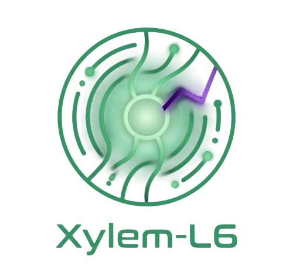
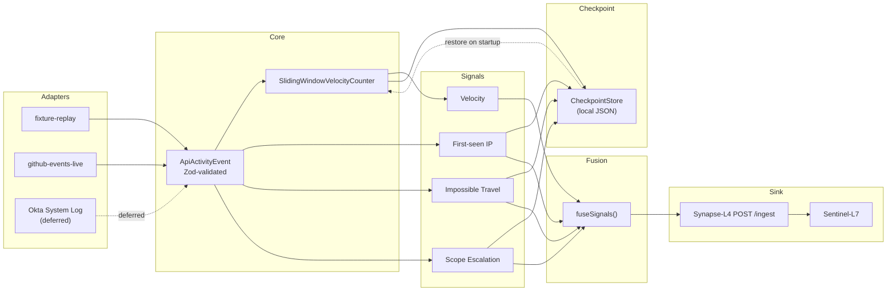

<p align="center">  </p>

**Xylem-L6** is a standalone TypeScript stream processor that ingests SaaS API activity and computes stateful security signals: request velocity, first-seen IP, impossible travel, and scope escalation.

It fills a gap in the wider [Rhizome Risk](https://github.com/obrienma/rhizome-risk) system: nothing else there holds state across events, computes over a sliding time window, or handles out-of-order arrival. Sliding-window logic, per-identity state, and late-event handling are built by hand rather than delegated to a framework. Rationale in [ADR 0001](https://github.com/obrienma/Xylem-L6/blob/master/docs/adr/0001-ingestion-target-stream-processor.md).

> **Status:** Wired to Sentinel-L7 via Synapse-L4 and verified end-to-end. The Synapse-L4 sink is opt-in; the default demo has no external dependencies.

## 📋 Contents

- [📋 Contents](#-contents)
- [🧰 Stack](#-stack)
- [🚀 Running the Project](#-running-the-project)
  - [✅ Prerequisites](#-prerequisites)
  - [⚡ Quick Start](#-quick-start)
- [🏗️ Architecture](#️-architecture)
  - [🔀 Pipeline Diagram](#-pipeline-diagram)
  - [🗂️ Provider Adapters](#️-provider-adapters)
- [📚 Docs](#-docs)
- [🗺️ Roadmap](#️-roadmap)
  - [📋 Planned Phases](#-planned-phases)
  - [🔭 Deliberately Deferred](#-deliberately-deferred)

## 🧰 Stack
-   **TypeScript + Zod:** the `ApiActivityEvent` contract and adapter inputs are validated at runtime.
-   **Adapters** behind one `ActivityAdapter` interface:
    -   `fixture-replay`: hand-authored events (baseline, burst, gap, late/out-of-order arrival, a second tenant)
    -   `github-events-live`: GitHub's public Events API
-   **Signals** (`src/core/`):
    -   Sliding-window velocity counter, driven by event time with a per-actor watermark
    -   First-seen IP tracker
    -   Impossible travel detector (haversine distance ÷ time delta)
    -   Scope escalation tracker
-   **Checkpointing:** tracker state is saved to a local JSON file after every event and restored on startup.
-   **Fusion** (`src/core/fusion.ts`): normalizes the four signals to `[0, 1]` and returns the max. See [ADR 0005](https://github.com/obrienma/Xylem-L6/blob/master/docs/adr/0005-fusion-function-max-of-signals.md).
-   **Synapse-L4 sink** (`src/sinks/synapse-l4/`): POSTs each fused score to Synapse-L4's `/ingest`. See [ADR 0007](https://github.com/obrienma/Xylem-L6/blob/master/docs/adr/0007-integrate-via-synapse-l4-ingest-not-direct-to-sentinel.md) and [ADR 0008](https://github.com/obrienma/Xylem-L6/blob/master/docs/adr/0008-synapse-l4-payload-mapping.md).
-   **Vitest + tsx** for tests and dev.
-   **Planned:** GCP Pub/Sub, Firestore, GKE ([ADR 0003](https://github.com/obrienma/Xylem-L6/blob/master/docs/adr/0003-gcp-deployment-target.md)).

## 🚀 Running the Project

### ✅ Prerequisites

-   Node.js 24+
-   A GitHub personal access token (no scopes needed), only required for the live adapter

### ⚡ Quick Start

```bash
npm install
npx tsc --noEmit
npm test

# Demo against fixture-replay (default, no credentials)
npm run dev

# Live GitHub activity
XYLEM_ADAPTER=github-events-live GITHUB_USERNAME=<you> GITHUB_TOKEN=<token> npm run dev

# Send fused scores to a local Synapse-L4 (default http://localhost:8000, override with SYNAPSE_L4_URL)
XYLEM_SYNAPSE_L4_ENABLED=true npm run dev
```

`npm run dev` prints one line per event: timestamp, tenant, actor, action, current velocity, the fused score, and a flag for any signal that fired (`[VELOCITY BREACH]`, `[FIRST-SEEN IP]`, `[IMPOSSIBLE TRAVEL]`, `[SCOPE ESCALATION]`).

State checkpoints to `.xylem-checkpoint.json` (override with `XYLEM_CHECKPOINT_FILE`) and resumes on the next run. Delete the file to start fresh.

## 🏗️ Architecture

### 🔀 Pipeline Diagram


```mermaid
flowchart LR
    subgraph Adapters
        F["fixture-replay"]
        G["github-events-live"]
        O["Okta System Log\n(deferred)"]
    end
    subgraph Core
        E[ApiActivityEvent\nZod-validated]
        W["SlidingWindowVelocityCounter"]
    end
    subgraph Signals
        V["Velocity"]
        FS["First-seen IP"]
        IT["Impossible Travel"]
        SE["Scope Escalation"]
    end
    subgraph Checkpoint
        CP["CheckpointStore\n(local JSON)"]
    end
    subgraph Fusion
        FN["fuseSignals()"]
    end
    subgraph Sink
        SY["Synapse-L4 POST /ingest"]
        S7["Sentinel-L7"]
    end

    F --> E
    G --> E
    O -.->|deferred| E
    E --> W
    E --> FS
    E --> IT
    E --> SE
    W --> V
    W --> CP
    FS --> CP
    IT --> CP
    SE --> CP
    CP -.->|restore on startup| W
    V --> FN
    FS --> FN
    IT --> FN
    SE --> FN
    FN --> SY
    SY --> S7
```

### 🗂️ Provider Adapters

| Adapter | Source | Notes |
| :-- | :-- | :-- |
| `fixture-replay` | Hand-authored events | Forces specific windowing conditions on demand (late event, burst, gap) that a live source can't. |
| `github-events-live` | GitHub public Events API | Real traffic, but public activity only, so no auth/session events for impossible travel. |
| Okta System Log | *Deferred* | Audit-log-shaped; would enable live impossible-travel and failed-auth demos. |

## 📚 Docs

| File | Contents |
| --- | --- |
| [adr/](https://github.com/obrienma/Xylem-L6/blob/master/docs/adr) | Architecture Decision Records (ADR-0001 – ADR-0032) |
| [journal/](https://github.com/obrienma/Xylem-L6/blob/master/docs/journal.md) | Engineering journal — one entry per phase | — |
| [USER\_STORIES.md](https://github.com/obrienma/Xylem-L6/blob/master/docs/USER_STORIES.md) | User stories tagged implemented / aspirational / deferred |

## 🗺️ Roadmap

### 📋 Planned Phases

**Done**

-   [x] Event schema, both adapters, sliding-window velocity counter
-   [x] First-seen IP, impossible travel, scope escalation
-   [x] Checkpointing to local JSON
-   [x] Sink and fusion decisions (ADRs 0004, 0005)
-   [x] Optional `tenant` field (ADR 0006)
-   [x] Fusion function implemented
-   [x] Synapse-L4 sink, verified end-to-end (ADRs 0007, 0008)

**Next**

-   [ ] Move `CheckpointStore` to Firestore ([ADR 0003](https://github.com/obrienma/Xylem-L6/blob/master/docs/adr/0003-gcp-deployment-target.md), still `Proposed`)

### 🔭 Deliberately Deferred

-   Okta System Log adapter
-   First-seen device / user-agent tracking (needs an event field no adapter supplies yet)
-   Failed-auth-burst signal (needs auth-event data)
-   Pub/Sub and GKE deployment
-   Composite tracker keying (`tenant:actor.id`) until a second real tenant exists

**Known limitations**

-   An event later than one full window behind the watermark may be undercounted; there is no configurable allowed-lateness yet.
-   Synapse-L4's Judge thresholds (`0.8` / `0.5`) are mirrored as literals here, with no contract test to catch drift.
-   Synapse-L4's `POST /ingest` has no auth, so the sink is suitable for local dev only.
-   The `tenant` payload field decided in ADR 0008's addendum is not yet implemented.