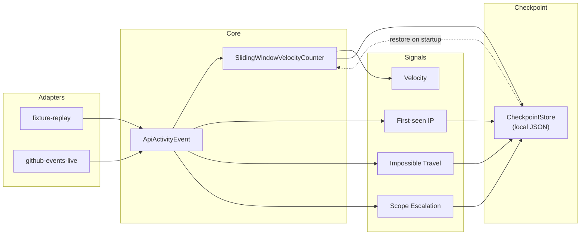

---

```markdown
---
type: cloze
deck: Rhizome::xylem-l6
tags: [xylem-l6, memento-pattern, checkpointing]
---
The {{c1::Memento}} pattern captures an object's internal state so it can be
externalized and restored later without breaking its encapsulation — each
Xylem-L6 tracker's `getState()`/`loadState()` pair implements it, with
`CheckpointStore` acting as the {{c2::caretaker}} that persists and retrieves
the snapshot without inspecting its contents.

Extra: xylem-l6 · Pattern: Memento (State Externalization)
See: docs/journal/xylem-l6-2026-07-13T2035-phase-3-checkpointing.md
```

```markdown
---
type: cloze
deck: Rhizome::xylem-l6
tags: [xylem-l6, schema-versioning, checkpointing]
---
Xylem-L6's checkpoint file carries a {{c1::version}} field; on a mismatch,
`CheckpointStore.load()` returns {{c2::null}} rather than attempting to
interpret an incompatible shape — converting silent schema drift into a
graceful cold start instead of a crash or corrupted state.

Extra: xylem-l6 · Anti-Pattern Avoided: Silent Schema Drift on Checkpoint Restore
See: docs/journal/xylem-l6-2026-07-13T2035-phase-3-checkpointing.md
```

```markdown
---
type: cloze
deck: Rhizome::xylem-l6
tags: [xylem-l6, watermark, checkpointing]
---
`SlidingWindowVelocityCounter` tracks two parallel per-actor maps:
{{c1::timestampsByActor}} (read by `count()`) and {{c2::watermarkByActor}}
(governs retention and late-event admission inside `record()`) — restoring
only the first after a checkpoint load would silently corrupt late-event
handling on the very next event.

Extra: xylem-l6 · Challenge: Watermark Omission Would Silently Reset Late-Event Handling
See: docs/journal/xylem-l6-2026-07-13T2035-phase-3-checkpointing.md
```

```markdown
---
type: basic
deck: Rhizome::xylem-l6
tags: [xylem-l6, checkpointing]
---
Q: Why does Xylem-L6's CheckpointStore save synchronously after every event
instead of on a timer/dirty-flag interval?

A: At demo-scale throughput, the durability benefit of zero gap between the
last processed event and the last persisted state outweighs the I/O cost of
a write per event. Interval-based debouncing is deferred as a real upgrade
path rather than solved now, and is kept cheap because every checkpoint
write already routes through one call site (checkpoint.save(...) in
index.ts) instead of being scattered through the signal-computation logic.

Extra: xylem-l6 · Decision: Checkpoint After Every Event, Not on an Interval
See: docs/journal/xylem-l6-2026-07-13T2035-phase-3-checkpointing.md
```

```markdown
---
type: cloze
deck: Rhizome::xylem-l6
tags: [xylem-l6, checkpointing]
---
Xylem-L6's Phase 3 checkpoint store persists to a single {{c1::local JSON
file}} (gitignored), an explicit placeholder for the Phase 4+
{{c2::GCP Firestore}} checkpoint store named in ADR 0001/0003 — it solves
single-machine restart survival only, deferring the multi-instance/
ephemeral-GKE-pod case to when GCP deployment is actually built.

Extra: xylem-l6 · Decision: Single JSON File, Local Disk, Versioned Schema
See: docs/journal/xylem-l6-2026-07-13T2035-phase-3-checkpointing.md
```

```markdown
---
type: image-occlusion
deck: Rhizome::xylem-l6
tags: [xylem-l6, checkpointing, pipeline]
diagram: xylem-l6-phase3-pipeline
---
occlusions:
  - node: CheckpointStore
    hint: what persists all four trackers' state to local JSON after every event?
    rect: left=.68:top=.55:width=.24:height=.10
  - node: restore on startup
    hint: what edge label describes how CheckpointStore feeds state back into the pipeline?
    rect: left=.40:top=.68:width=.28:height=.08

Header: Xylem-L6 Phase 3 Pipeline (with checkpointing)
Back Extra: xylem-l6 · Pattern: Memento (State Externalization)
See: docs/journal/xylem-l6-2026-07-13T2035-phase-3-checkpointing.md
```
