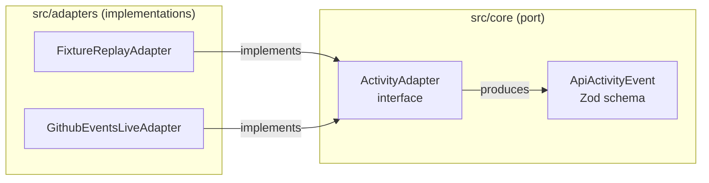

The `{{c1::ActivityAdapter}}` interface is the **port** in Xylem-L6's Ports and Adapters layout; `FixtureReplayAdapter` and `GithubEventsLiveAdapter` are the two adapters implementing it, both producing the canonical `{{c2::ApiActivityEvent}}` contract.

Extra: xylem-l6 · Pattern: Ports and Adapters (Hexagonal Architecture)
See: docs/journal/xylem-l6-2026-07-13T2252-project-scaffolding.md

---
type: cloze
deck: Rhizome::xylem-l6
tags: [xylem-l6, schema-validation, zod]
---
`{{c1::Zod}}` is the runtime schema-validation layer for `ApiActivityEvent` — the same "runtime validation is a discipline, not a language feature" role Pydantic/Instructor play elsewhere in the Rhizome Risk suite.

Extra: xylem-l6 · Pattern: Schema-First Validation at the System Boundary
See: docs/journal/xylem-l6-2026-07-13T2252-project-scaffolding.md

---
type: cloze
deck: Rhizome::xylem-l6
tags: [xylem-l6, typescript, tsconfig]
---
TypeScript's `{{c1::rootDir}}` constrains which files may be included in a project, not merely where compiled output is emitted — pinning it to `src` while `include` also pulled in `tests/` caused a {{c2::TS6059}} error.

Extra: xylem-l6 · Challenge: tsc rootDir Conflict with Test Directory
See: docs/journal/xylem-l6-2026-07-13T2252-project-scaffolding.md

---
type: basic
deck: Rhizome::xylem-l6
tags: [xylem-l6, typescript, vitest, toolchain]
---
Q: Why did `npm test` (Vitest) pass on the test file while `npx tsc --noEmit` failed on the same file, during Xylem-L6's scaffolding phase?

A: Vitest type-checks/transforms via esbuild and doesn't enforce `rootDir` the way `tsc` does — esbuild only transpiles, it doesn't run the same full-project structural check `tsc` does. So a `rootDir` misconfiguration that made `tsc --noEmit` fail with TS6059 was invisible to the test runner; the two tools' notion of "the project compiles" had silently diverged.

Extra: xylem-l6 · Challenge: tsc rootDir Conflict with Test Directory
See: docs/journal/xylem-l6-2026-07-13T2252-project-scaffolding.md

---
type: basic
deck: Rhizome::xylem-l6
tags: [xylem-l6, toolchain, decision]
---
Q: Why was Vitest chosen over Jest for Xylem-L6, given the project runs `"type": "module"` + NodeNext?

A: Vitest is ESM-native by default, so it doesn't need the transform/config wrestling Jest has historically required to run under ESM + NodeNext module resolution. `tsx` was paired with it for dev (run TypeScript directly, no separate build step), and npm was used over pnpm/yarn simply because neither was installed in this environment — a reversible tooling choice, not an ADR-level architectural commitment.

Extra: xylem-l6 · Decision: Vitest + tsx + npm, Not Jest/ts-node/pnpm
See: docs/journal/xylem-l6-2026-07-13T2252-project-scaffolding.md

---

---
type: image-occlusion
deck: Rhizome::xylem-l6
tags: [xylem-l6, ports-and-adapters]
diagram: xylem-l6-ports-and-adapters
---
occlusions:
  - node: Port
    hint: what interface do both adapters implement?
    rect: left=.08:top=.15:width=.30:height=.14
  - node: FR
    hint: which adapter forces windowing edge cases on demand?
    rect: left=.55:top=.08:width=.32:height=.12
  - node: GH
    hint: which adapter is genuine live traffic from a real account?
    rect: left=.55:top=.30:width=.32:height=.12

Header: Xylem-L6 Ports and Adapters (Phase 0 scaffolding)
Back Extra: xylem-l6 · Pattern: Ports and Adapters (Hexagonal Architecture)
See: docs/journal/xylem-l6-2026-07-13T2252-project-scaffolding.md
