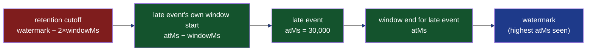

Xylem-L6's `SlidingWindowVelocityCounter` windows on each event's own `{{c1::atMs}}` timestamp, not wall-clock processing time — the formal distinction is `{{c2::event-time}}` vs. processing-time windowing.

Extra: xylem-l6 · Pattern: Event-Time Processing (vs. Processing-Time)
See: docs/journal/xylem-l6-2026-07-13T2315-phase-1-adapters-and-velocity-counter.md

---
type: cloze
deck: Rhizome::xylem-l6
tags: [xylem-l6, watermark, allowed-lateness]
---
`SlidingWindowVelocityCounter` retains entries within `{{c1::2 × windowMs}}` of the per-actor watermark, not just `windowMs` — a fixed stand-in for a real `{{c2::allowed-lateness}}` parameter, sized so a late event's own trailing window can still reach back far enough.

Extra: xylem-l6 · Pattern: Watermark-Governed Retention with a Fixed Allowed-Lateness Bound
See: docs/journal/xylem-l6-2026-07-13T2315-phase-1-adapters-and-velocity-counter.md

---
type: cloze
deck: Rhizome::xylem-l6
tags: [xylem-l6, testing, mocking]
---
`GithubEventsLiveAdapter` accepts an injectable `{{c1::fetchImpl}}` (default global `fetch`) and exposes `{{c2::pollOnce()}}` separately from the infinite `stream()` loop, specifically so tests can mock at the interface boundary without touching real network I/O.

Extra: xylem-l6 · Decision: fetchImpl Injection as the GitHub Adapter's Test Boundary
See: docs/journal/xylem-l6-2026-07-13T2315-phase-1-adapters-and-velocity-counter.md

---
type: basic
deck: Rhizome::xylem-l6
tags: [xylem-l6, watermark, bug]
---
Q: Why did the first watermark-retention formula (`watermark - windowMs`) fail the out-of-order test — a late event reported velocity 1 instead of 2, and an earlier entry had vanished from storage?

A: The cutoff was sized for "how far back does the *current* watermark's own window reach," not "how far back could a still-valid *late* call's window reach." At watermark 61,000ms with a 60,000ms window, the cutoff was 1,000ms — so the 0ms entry was pruned before a later query at atMs=30,000 (whose own window reaches back to -30,000) could use it. The fix widened retention to `2 × windowMs` behind the watermark, since a late event can itself be up to one windowMs behind the watermark, and its own window then reaches a further windowMs back from there.

Extra: xylem-l6 · Challenge: Watermark Retention Silently Dropped Data a Late Event Still Needed
See: docs/journal/xylem-l6-2026-07-13T2315-phase-1-adapters-and-velocity-counter.md

---
type: basic
deck: Rhizome::xylem-l6
tags: [xylem-l6, decision, scope]
---
Q: Why did Xylem-L6 hardcode retention as `2 × windowMs` instead of adding a separate `allowedLateness` config, the way Flink/Beam actually expose it?

A: ADR 0001's Phase 1 scope asks for "an in-memory sliding-window velocity counter," not a general late-data policy, and a real allowedLateness knob has no consumer yet to justify its shape (duration? count? per-signal?). The concrete trigger for generalizing it is Phase 2's first-seen/impossible-travel signals needing a different lateness tolerance than velocity does — not speculative design now.

Extra: xylem-l6 · Decision: Fixed 2×windowMs Retention, Not a Separate allowedLateness Parameter
See: docs/journal/xylem-l6-2026-07-13T2315-phase-1-adapters-and-velocity-counter.md

---

---
type: image-occlusion
deck: Rhizome::xylem-l6
tags: [xylem-l6, watermark, retention]
diagram: xylem-l6-watermark-retention
---
occlusions:
  - node: A
    hint: what's the retention cutoff, expressed in terms of windowMs?
    rect: left=.03:top=.35:width=.20:height=.20
  - node: C
    hint: where does the late event itself sit in this timeline?
    rect: left=.42:top=.35:width=.16:height=.20
  - node: E
    hint: what governs the retention cutoff's position?
    rect: left=.80:top=.35:width=.17:height=.20

Header: Xylem-L6 Watermark Retention (Phase 1)
Back Extra: xylem-l6 · Pattern: Watermark-Governed Retention with a Fixed Allowed-Lateness Bound
See: docs/journal/xylem-l6-2026-07-13T2315-phase-1-adapters-and-velocity-counter.md
